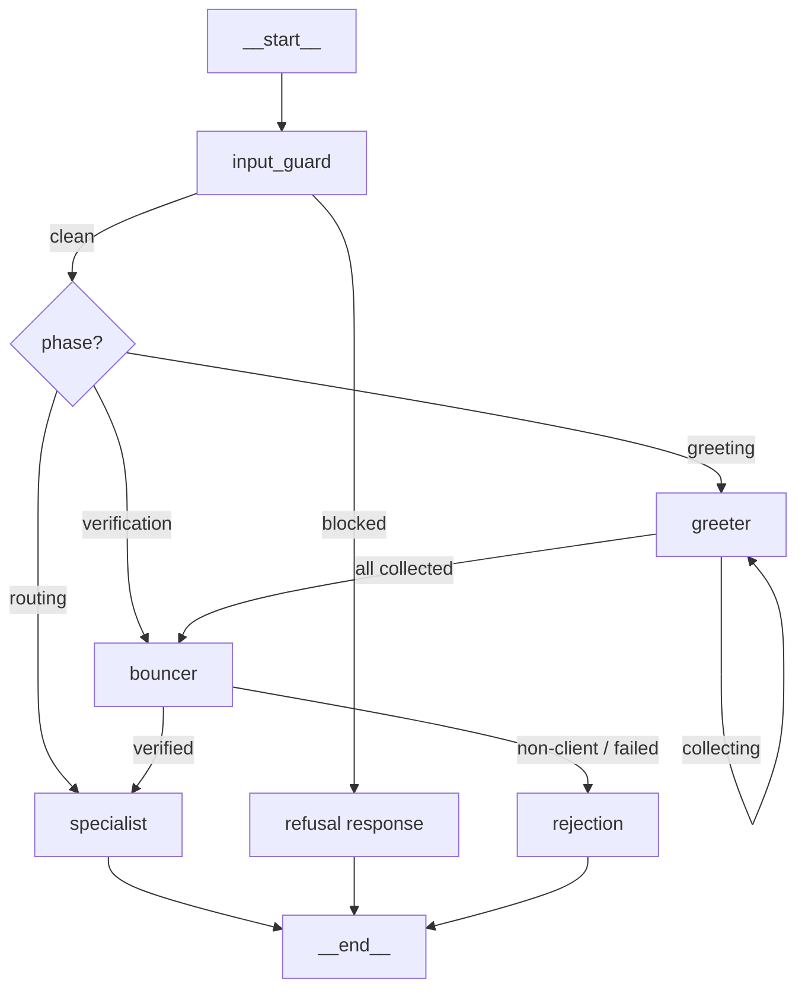

# Solution: DEUS Bank AI Customer Support

## Architecture

The system uses a **linear LangGraph state machine** with three specialized agents and a guardrails pipeline:



### Agents

| Agent | Role | Input | Output |
|-------|------|-------|--------|
| **Greeter** | Collects name, phone, IBAN conversationally | User messages | Extracted identifiers |
| **Bouncer** | Verifies 2/3 identity match, asks secret question (3 attempts), classifies tier | Identifiers | Verification result + tier |
| **Specialist** | Classifies request into department, provides support number | Verified user + request | Department + phone number |

### Guardrails Pipeline (Three-Tier PII Protection)

1. **Input Guard** — Regex pattern matching for 12 prompt injection patterns (role-play, instruction override, system prompt extraction)
2. **Structured Outputs** — Pydantic schemas constrain each agent's response format
3. **Output Policy** — Three-tier defense for PII protection:
   - **Prompt enforcement** — Agent system prompts explicitly forbid echoing phone numbers or IBANs
   - **LLM retry** — If PII is detected in the response, the LLM is re-invoked with a correction instruction (up to 3 retries)
   - **Redaction fallback** — After retries exhausted, PII is silently stripped with `[REDACTED]`

### Tech Stack

| Component | Technology |
|-----------|-----------|
| Agent orchestration | LangGraph (Python) |
| LLM | Gemini Flash via AI Studio |
| API | FastAPI |
| Data store | SQLite |
| Testing | pytest (77 unit/API tests + 6 E2E scenarios) |

## Setup

### Prerequisites

- Python 3.10+
- [uv](https://docs.astral.sh/uv/) package manager
- Gemini API key from [Google AI Studio](https://aistudio.google.com/)

### Install

```bash
# Clone and install dependencies
git clone <repo-url>
cd ai-eng-challenge
uv sync --all-extras

# Configure API key
cp .env.example .env
# Edit .env and set GEMINI_API_KEY=your-key-here
```

### Run

```bash
uv run uvicorn src.app:app --reload
```

Server starts at `http://localhost:8000`. API docs at `http://localhost:8000/docs`.

### Run with Docker

```bash
# Build and start
docker compose up --build

# Or build manually
docker build -t deus-bank-support .
docker run -p 8000:8000 --env-file .env deus-bank-support
```

### Test

```bash
# Unit tests (no API key needed)
uv run pytest tests/ --ignore=tests/test_e2e.py -v

# E2E tests (requires GEMINI_API_KEY in .env, subject to rate limits)
uv run pytest tests/test_e2e.py -v -s
```

## API Usage

### Start a conversation

```bash
curl -X POST http://localhost:8000/chat/start
```

Response:
```json
{
  "session_id": "550e8400-e29b-41d4-a716-446655440000",
  "message": "Welcome to DEUS Bank! I'd be happy to help you today. Could you please provide me with your name?"
}
```

### Send a message

```bash
curl -X POST http://localhost:8000/chat/message \
  -H "Content-Type: application/json" \
  -d '{"session_id": "550e8400-e29b-41d4-a716-446655440000", "message": "My name is Lisa"}'
```

Response:
```json
{
  "message": "Thank you, Lisa! Could you also provide your phone number?",
  "phase": "greeting"
}
```

### Example: Full premium client flow

```bash
# 1. Start
curl -s -X POST http://localhost:8000/chat/start | jq .

# 2. Provide name
curl -s -X POST http://localhost:8000/chat/message \
  -d '{"session_id": "<id>", "message": "My name is Lisa"}' | jq .

# 3. Provide phone
curl -s -X POST http://localhost:8000/chat/message \
  -d '{"session_id": "<id>", "message": "+1122334455"}' | jq .

# 4. Provide IBAN
curl -s -X POST http://localhost:8000/chat/message \
  -d '{"session_id": "<id>", "message": "DE89370400440532013000"}' | jq .

# 5. Answer secret question ("Which is the name of my dog?")
curl -s -X POST http://localhost:8000/chat/message \
  -d '{"session_id": "<id>", "message": "Yoda"}' | jq .

# 6. Describe your request
curl -s -X POST http://localhost:8000/chat/message \
  -d '{"session_id": "<id>", "message": "I need help with my insurance"}' | jq .
```

### Health check

```bash
curl http://localhost:8000/health
# {"status": "ok"}
```

## Design Decisions

1. **Linear graph over hub-and-spoke** — Simpler to test and debug, matches the reference diagram
2. **Gemini Flash for all agents** — Free tier, fast enough for classification/extraction tasks
3. **Single `customers` table** — No premature normalization for 8 seed records
4. **Regex-first input guard** — No LLM latency on every message; catches common injection patterns deterministically
5. **Command pattern for routing** — Agents return `Command(update=..., goto=...)` for clean state transitions
6. **Three-tier PII protection** — Prompt enforcement, LLM retry, then redaction fallback; avoids both false positives and data leaks
7. **One LLM call per turn** — Each `graph.invoke()` processes exactly one turn to avoid rate-limit issues and keep conversations predictable

## Project Structure

```
src/
  agents/
    greeter.py        # Greeter agent + GreeterOutput schema
    bouncer.py        # Bouncer agent + BouncerOutput schema
    specialist.py     # Specialist agent + SpecialistOutput schema
  prompts/
    greeter.txt       # Greeter system prompt
    bouncer_verify.txt       # Bouncer identity verification prompt
    bouncer_secret_check.txt # Bouncer secret answer check prompt
    specialist.txt    # Specialist routing prompt
    pii_retry.txt     # PII retry correction instruction
  guardrails.py       # Input guard + output policy + PII retry logic
  graph.py            # LangGraph builder + conditional edges
  database.py         # SQLite setup, seed data, Customer model, lookups
  schemas.py          # ConversationState TypedDict
  app.py              # FastAPI app, routes, session management
tests/
  test_database.py    # 22 tests: matching logic, normalization
  test_agents.py      # 9 tests: output schemas, constants
  test_guardrails.py  # 35 tests: injection detection, PII leakage, helpers
  test_api.py         # 11 tests: HTTP routing, sessions, error handling
  test_e2e.py         # 6 E2E scenarios: injection, non-client, failed-secret, premium, regular, partial-id
  e2e_reports/        # Saved conversation transcripts from E2E runs
```

## E2E Test Results

Six scenarios validated against the real Gemini API:

| Scenario | Turns | Tier | Department | Support Number | Result |
|----------|-------|------|-----------|---------------|--------|
| Injection blocked | 1 | - | - | None leaked | PASS |
| Non-client (Bob Nobody) | 2 | non_client | - | None leaked | PASS |
| Failed secret (Lisa, 3 wrong) | 5 | non_client | - | None leaked | PASS |
| Premium (Lisa, 3/3 fields) | 4 | premium | insurance | +1999888999 | PASS |
| Regular (Anna Schmidt) | 4 | regular | general | +1112112112 | PASS |
| Partial ID (Lisa, 2/3 fields) | 4 | premium | loans | +1999888999 | PASS |

Reports saved in `tests/e2e_reports/`.

## CI/CD

GitHub Actions runs on every push and PR to `main`/`dev`:

- Installs dependencies with uv
- Runs 77 unit/API tests
- Verifies the LangGraph compiles correctly

See `.github/workflows/ci.yml`.

## Conversation History

Conversation state is persisted to SQLite (`conversations.db`) via LangGraph's `SqliteSaver` checkpointer. Sessions survive server restarts — a customer can resume their conversation after a disconnect or reboot.

## Known Limitations

1. **No rate limiting** — Brute-force verification attempts are possible
2. **Oracle attack** — Reaching the secret question stage confirms 2/3 identifiers are valid
3. **English only** — No multilingual support
4. **No session timeout** — Sessions persist indefinitely
5. **First-match only** — If multiple records match 2/3 identifiers, the first is used
